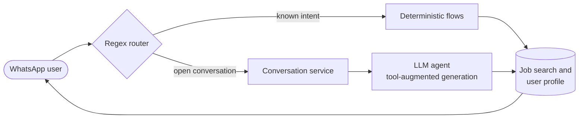

<!-- Header -->

  

  

  
  
  
  
  

---

## About

Software engineer and student building **AI products end to end** — from architecture to production on AWS.
I designed, built and run **CIO**, a WhatsApp AI job-search assistant, and I'm the primary contributor to
**Almia's hiring platform**, where I shipped an AI recruiting agent and a RAG talent pool on Amazon Bedrock and pgvector.
I moved its core API to **ECS Fargate** following AWS Well-Architected, and I work with ML and data at scale in **PySpark** and **Spark MLlib**.

I use LLMs where they move a business metric, keeping **cost, reliability and observability** in check.

<table align="center">
  <tr>
    <td align="center" width="25%"><h3>2,400+</h3>registered users on CIO, my WhatsApp AI assistant</td>
    <td align="center" width="25%"><h3>99%</h3>uptime sustained on AWS (ECS, EC2, S3, Amplify)</td>
    <td align="center" width="25%"><h3>−70%</h3>incident response time with in-house observability tooling</td>
    <td align="center" width="25%"><h3>10.6M</h3>records processed in a PySpark medallion lakehouse</td>
  </tr>
</table>

**Right now**

- Full-Stack Developer (AI focus) at **Almia** — owning the platform end to end, from core services to production.
- Studying **Software Engineering** at Universidad ICESI (2022 – 2027).
- Going deeper into **agentic systems**, **RAG** and **distributed data processing**.

---

## Featured Work

<table>
  <tr>
    <td width="50%" valign="top">
      <h4><a href="https://github.com/criskian/cazador-inteligente-de-oportunidades">CIO — Cazador Inteligente de Oportunidades</a></h4>
      WhatsApp conversational assistant that guides people through their job search. Combines regular-expression routing, a dedicated conversation service and LLM-based conversational AI. Grew to <b>2,400+ registered users</b>.
        
      
      
      
      
    </td>
    <td width="50%" valign="top">
      <h4>Almia — AI Hiring Platform</h4>
      Primary contributor. Shipped an AI recruiting agent and a RAG talent pool (Amazon Bedrock, pgvector), candidate-sourcing and interview-scheduling systems, and tool-augmented generation with Strands Agents over OpenAI and Anthropic APIs across <b>3 product suites</b>.
        
      
      
      
      
    </td>
  </tr>
  <tr>
    <td width="50%" valign="top">
      <h4>Retail Transactions Lakehouse</h4>
      End-to-end medallion lakehouse (Bronze / Silver / Gold) over <b>1.1M real grocery transactions</b> → 10.6M item-level records and 15 analytical marts. K-Means segmentation, FP-Growth association rules and ALS recommendations with Spark MLlib; 26 data-quality contracts, CI/CD and a Streamlit dashboard on DuckDB.
        
      
      
      
      
    </td>
    <td width="50%" valign="top">
      <h4><a href="https://github.com/criskian/zulay-c-ecommerce">Zulay C — E-commerce Platform</a></h4>
      Freelance, end-to-end e-commerce platform for a footwear and apparel retailer. Owned requirements elicitation, cost estimates, architecture and full-stack delivery: storefront, back office, product catalog and order flows.
        
      
      
      
    </td>
  </tr>
</table>

<b>How CIO works</b>

 

Routing cheap, predictable requests with regular expressions and reserving the LLM for open-ended conversation keeps cost and latency low without losing flexibility.

---

## Tech Stack

<table>
  <tr>
    <td><b>Languages</b></td>
    <td></td>
  </tr>
  <tr>
    <td><b>Web &amp; APIs</b></td>
    <td></td>
  </tr>
  <tr>
    <td><b>Cloud &amp; DevOps</b></td>
    <td></td>
  </tr>
  <tr>
    <td><b>Databases</b></td>
    <td></td>
  </tr>
  <tr>
    <td><b>AI &amp; LLMs</b></td>
    <td>
      
      
      
      
      
      
    </td>
  </tr>
  <tr>
    <td><b>Data Engineering</b></td>
    <td>
      
      
      
      
      
      
    </td>
  </tr>
</table>

---

## Experience

<b>Almia</b> — Full-Stack Developer (AI Focus) · <i>Nov 2025 – Present · Remote</i>

 

- Architected and built the company's software platform **end to end**: core services, microservices and landing pages, alongside separate product suites powering AI-driven employability tools.
- Designed and shipped **CIO**, a WhatsApp conversational bot, growing it to **2,400+ registered users**.
- Built **candidate-sourcing and interview-scheduling systems**, plus products for resume improvement, interview preparation and personalized job-market gap analysis.
- Engineered AI features with **Strands Agents** orchestrating **OpenAI and Anthropic APIs** for structured, tool-augmented generation across 3 product suites.
- Implemented **CI/CD with GitHub Actions** and a defined Git branching strategy to ship reliably across environments.
- Orchestrated deployments on **AWS (ECS, EC2, S3, Amplify, Route 53)**, sustaining **99% uptime**.
- Developed internal administration and **observability systems**, reducing incident response time by **70%**.

<b>Outlier</b> — Software Engineer, AI Training (Freelance) · <i>Oct 2024 – Oct 2025 · Remote</i>

 

- Trained and improved large language models for **Meta** as a subject-matter expert, producing and correcting reference responses in TypeScript and Python.
- Built and reviewed problem/solution pairs with NumPy, pandas and Matplotlib to surface model failures and raise code-generation accuracy.
- Delivered rubric-based evaluation across **300+ coding tasks** with a **90%** acceptance rate.

<b>Freelance</b> — Software Engineer · <i>Jan 2025 – Apr 2025 · Remote</i>

 

- Delivered an end-to-end e-commerce platform for **Zulay C**, owning architecture and full-stack development.
- Led requirements elicitation with the client and produced cost estimates to scope the project.

<b>Integrador 2 — Graduate Studies Platform</b> (Universidad ICESI) · <i>Jan 2026 – May 2026</i>

 

- Delivered, within a Scrum team, a management platform for ICESI's graduate office (curricula, professors, programs).
- Implemented the intelligent features: **constraint- and availability-based schedule generation**, Excel curriculum import and editing, and **Google Calendar** integration.

---

## Education &amp; Certifications

| | |
|---|---|
| **Universidad ICESI** | B.S. Software Engineering · Cali, Colombia · 2022 – 2027 |
| **Google** | Google Cloud Data Analytics Certificate · 2025 |
| **DataCamp** | Data Analyst in Databricks · 2025 |
| **Lovelytics** | SQL on Databricks · 2025 |
| **DataCamp** | Intermediate Python · 2025 |

**Languages:** Spanish (native) · English (advanced, certified)

---

## GitHub Activity

  <picture>
    <source media="(prefers-color-scheme: dark)" srcset="./profile/stats-dark.svg" />
    <source media="(prefers-color-scheme: light)" srcset="./profile/stats-light.svg" />
    
  </picture>
  <picture>
    <source media="(prefers-color-scheme: dark)" srcset="./profile/top-langs-dark.svg" />
    <source media="(prefers-color-scheme: light)" srcset="./profile/top-langs-light.svg" />
    
  </picture>

  <picture>
    <source media="(prefers-color-scheme: dark)" srcset="https://streak-stats.demolab.com?user=criskian&theme=dark&hide_border=true&background=0D1117&ring=58A6FF&fire=58A6FF&currStreakLabel=58A6FF" />
    <source media="(prefers-color-scheme: light)" srcset="https://streak-stats.demolab.com?user=criskian&theme=default&hide_border=true&ring=0969DA&fire=0969DA&currStreakLabel=0969DA" />
    
  </picture>

  <picture>
    <source media="(prefers-color-scheme: dark)" srcset="./profile/snake-dark.svg" />
    <source media="(prefers-color-scheme: light)" srcset="./profile/snake-light.svg" />
    
  </picture>

<!-- Footer -->

  

