<!-- Header -->

  

  

  
  
  
  

---

## About me

I'm a software engineer from Cali, Colombia, who enjoys taking an idea all the way to production:
designing the architecture, writing the code on both ends, and running it in the cloud.
Most of what I build today sits where **AI, cloud and data** meet — LLM agents that actually solve a problem,
backends that stay reliable, and data pipelines that turn raw records into something useful.

- I like shipping products real people use, and measuring whether they help.
- I use LLMs where they add value, keeping cost, reliability and observability in check.
- Currently exploring agentic systems, RAG and distributed data processing with Spark.

---

## Tech Stack

  
   
  

  
  
  
  
  
  
  
  

---

## Projects

<table>
  <tr>
    <td width="50%" valign="top">
      <h4><a href="https://cio.almia.com.co/">CIO — WhatsApp AI Job Assistant</a></h4>
      A conversational assistant that helps people with their job search on WhatsApp. 2,400+ users.
        
      
      
      
    </td>
    <td width="50%" valign="top">
      <h4><a href="https://www.almia.com.co">Almia — AI Hiring Platform</a></h4>
      Hiring platform with an AI recruiting agent and a RAG talent pool.
        
      
      
      
    </td>
  </tr>
  <tr>
    <td width="50%" valign="top">
      <h4><a href="https://retail-transactions-lakehouse.streamlit.app/">Retail Transactions Lakehouse</a></h4>
      Medallion lakehouse with PySpark and Spark MLlib over 1.1M grocery transactions, with a Streamlit dashboard.
        
      
      
      
    </td>
    <td width="50%" valign="top">
      <h4><a href="https://github.com/criskian/zulay-c-ecommerce">Zulay C — E-commerce</a></h4>
      Storefront and back office for a footwear and apparel retailer.
        
      
    </td>
  </tr>
</table>

---

## GitHub Activity

  <picture>
    <source media="(prefers-color-scheme: dark)" srcset="./profile/stats-dark.svg" />
    <source media="(prefers-color-scheme: light)" srcset="./profile/stats-light.svg" />
    
  </picture>
  <picture>
    <source media="(prefers-color-scheme: dark)" srcset="./profile/top-langs-dark.svg" />
    <source media="(prefers-color-scheme: light)" srcset="./profile/top-langs-light.svg" />
    
  </picture>

  <picture>
    <source media="(prefers-color-scheme: dark)" srcset="https://streak-stats.demolab.com?user=criskian&theme=dark&hide_border=true&background=0D1117&ring=58A6FF&fire=58A6FF&currStreakLabel=58A6FF" />
    <source media="(prefers-color-scheme: light)" srcset="https://streak-stats.demolab.com?user=criskian&theme=default&hide_border=true&ring=0969DA&fire=0969DA&currStreakLabel=0969DA" />
    
  </picture>

  <picture>
    <source media="(prefers-color-scheme: dark)" srcset="./profile/snake-dark.svg" />
    <source media="(prefers-color-scheme: light)" srcset="./profile/snake-light.svg" />
    
  </picture>

<!-- Footer -->

  

